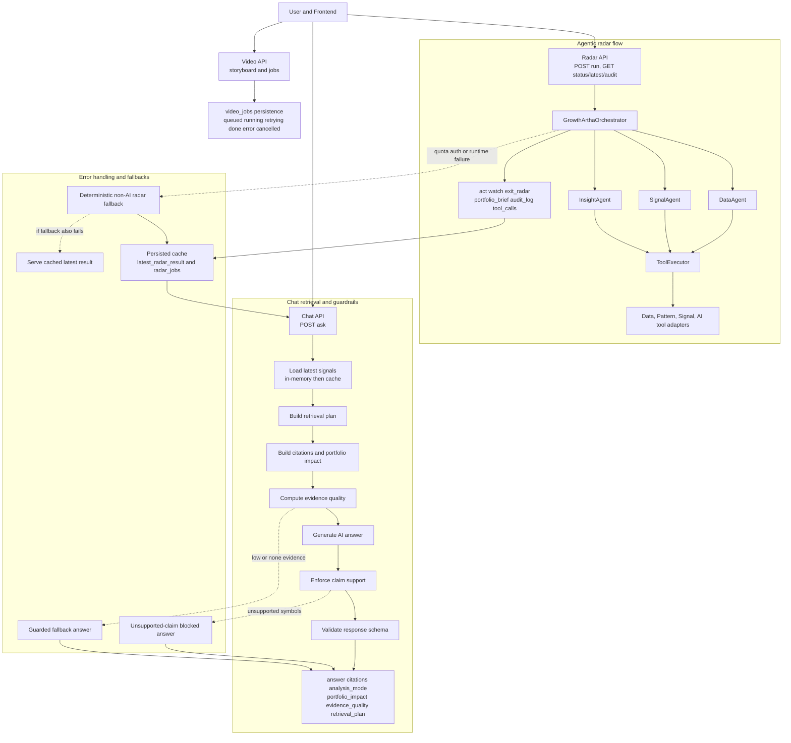
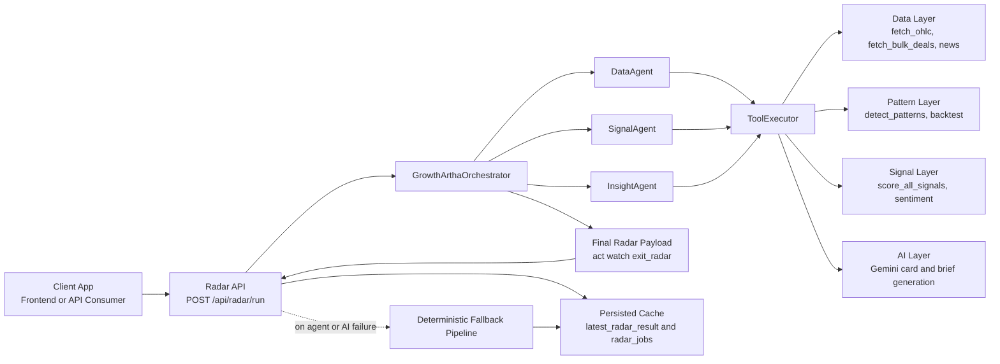
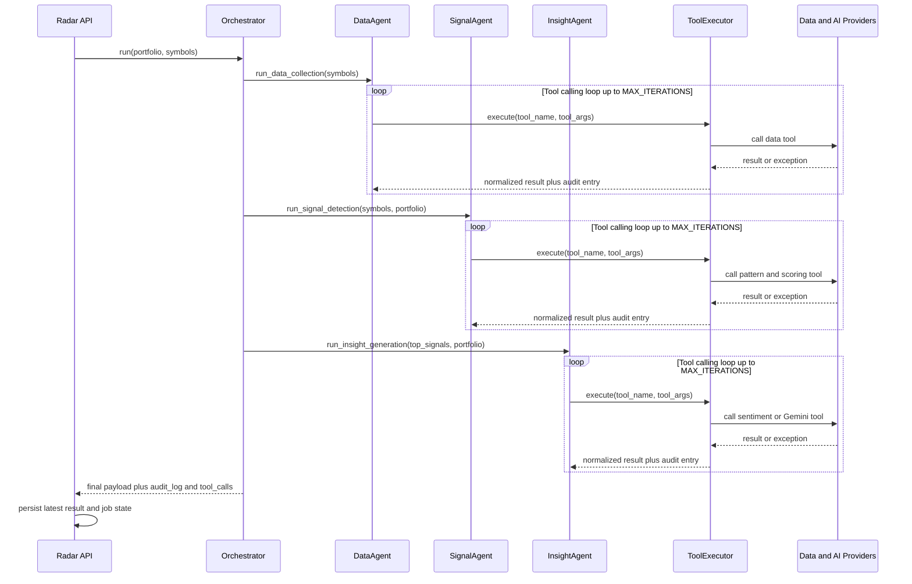
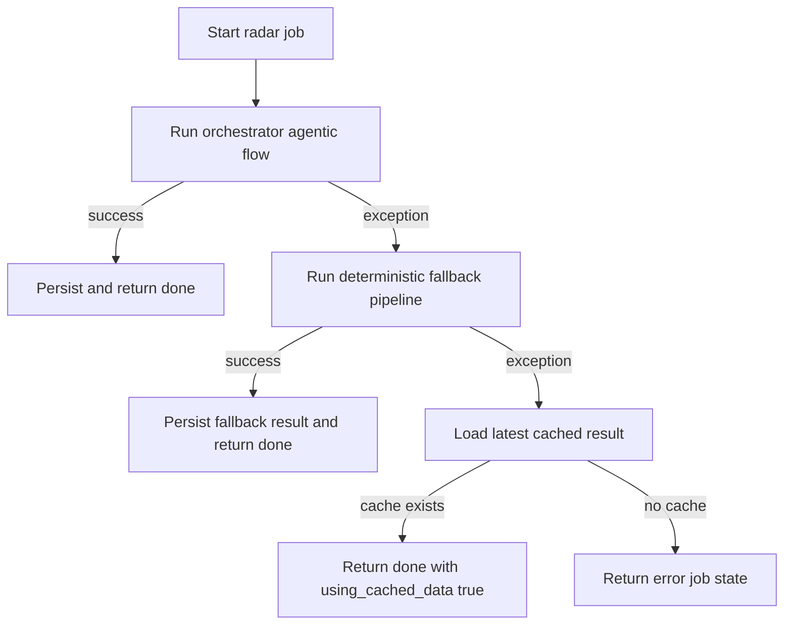
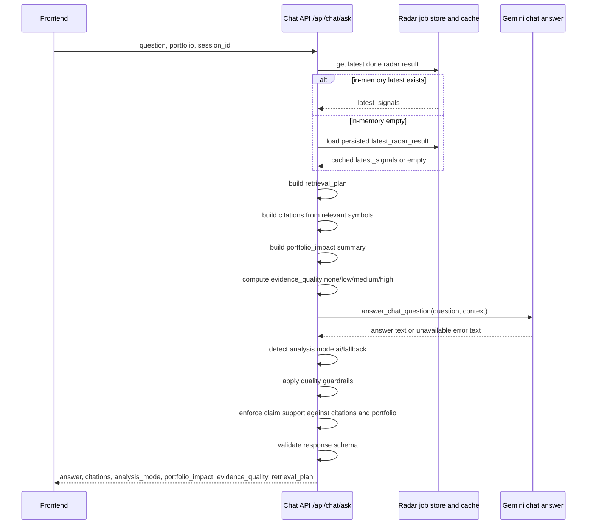
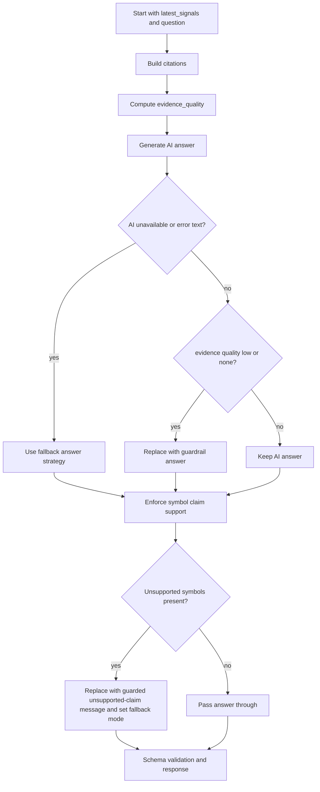

# Growth Artha Agent System Architecture

This document explains:
- Agent roles and responsibilities
- How agents communicate
- Tool integration boundaries
- Error-handling and fallback logic

It is aligned with the current backend implementation in:
- backend/agents/orchestrator.py
- backend/agents/executor.py
- backend/agents/tools.py
- backend/api/radar.py

## 0. Single-page system map

## 1. High-level architecture

## 2. Agent roles

### DataAgent

Purpose:
- Collect market input data only
- No scoring, no investor narrative

Typical tools used:
- fetch_stock_ohlc
- fetch_bulk_deals
- fetch_news_headlines

Output intent:
- Data completeness summary for the next stage

### SignalAgent

Purpose:
- Convert raw data into pattern and score outcomes
- Rank by convergence score

Typical tools used:
- detect_patterns
- run_backtest
- score_stock_signals

Output intent:
- Ranked signal list with Act, Watch, Exit orientation

### InsightAgent

Purpose:
- Build human-readable intelligence output from scored signals
- Enrich high-conviction names with sentiment and narrative

Typical tools used:
- generate_alert_card
- analyse_sentiment
- generate_portfolio_brief

Output intent:
- Final investor-facing package: act, watch, exit_radar, portfolio_brief

## 3. Communication and orchestration flow

## 4. Tool integration contract

The ToolExecutor is the boundary between AI agent reasoning and deterministic backend logic.

### Responsibilities of ToolExecutor
- Route each tool name to concrete python function(s)
- Cache intermediate datasets in-memory for the scan session
- Catch exceptions and return structured error payloads
- Write per-tool audit entries with timing and summary

### Internal execution caches
- OHLC cache for symbol data reuse
- Bulk deal cache reused across multiple stock scoring calls
- Pattern cache reused before backtest/scoring

### Integration matrix

| Tool name | Integration target | Domain |
|---|---|---|
| fetch_stock_ohlc | backend.data.fetcher.fetch_ohlc | market data |
| fetch_bulk_deals | backend.data.fetcher.fetch_bulk_deals | events |
| fetch_news_headlines | backend.signals.sentiment.fetch_news_headlines | news |
| detect_patterns | backend.patterns.detector.detect_patterns | chart intelligence |
| run_backtest | backend.patterns.backtester.backtest_pattern | reliability |
| score_stock_signals | backend.signals.scorer.score_all_signals | scoring |
| generate_alert_card | backend.ai.gemini_client.generate_signal_card | narrative AI |
| analyse_sentiment | backend.signals.sentiment.analyse_sentiment | sentiment |
| generate_portfolio_brief | backend.ai.gemini_client.generate_portfolio_summary | portfolio AI |

## 5. Error-handling logic

### A. Agent-level AI failure behavior

Inside BaseAgent:
- Gemini responses are requested in an iterative loop with MAX_ITERATIONS
- Quota/auth related errors are treated as fail-fast
- On these errors, the code raises an exception to the API layer instead of endless retries

Fail-fast trigger tokens include:
- 429, 403, 401
- RESOURCE_EXHAUSTED
- PERMISSION_DENIED

### B. Tool-level failure behavior

Inside ToolExecutor:
- Any tool exception is caught
- Return payload includes error field
- Audit row is still recorded with status error and elapsed_ms
- Pipeline remains observable even when individual tool calls fail

### C. API-level fallback behavior

Inside Radar API async job runner:
1. Try orchestrator (agentic path)
2. If exception occurs, run deterministic non-AI fallback pipeline
3. If fallback also fails, attempt cached latest result
4. If no cache available, mark job status as error

## 6. Observability and traceability

Every run can expose:
- reasoning_log from each agent stage
- tool_calls from ToolExecutor audit log
- elapsed_seconds and scanned_at
- fallback indicators such as:
  - using_non_ai_fallback
  - using_cached_data
  - fallback_reason
  - fallback_trigger

This supports:
- Explainability in UI and API consumers
- Post-mortem debugging
- Reliability monitoring

## 7. Practical behavior summary

- Normal case: DataAgent -> SignalAgent -> InsightAgent -> persisted result
- AI constrained case: orchestrator aborts fast -> deterministic fallback still provides actionable radar buckets
- Severe failure case: cached latest result still serves user continuity

This layered strategy ensures the scan endpoint remains operational even during upstream AI instability.

## 8. Chat pipeline orchestration and guardrails

This section maps to the current logic in backend/api/chat.py.

### A. Chat request processing flow

### B. Evidence and claim-support control path

### C. Guardrail stages implemented

1. Retrieval planning
- Infers question intent (general, explain, risk, portfolio)
- Builds deterministic step list for transparency
- Includes bucket counts and portfolio hits

2. Citation construction
- Pulls evidence from radar Act/Watch/Exit rows
- Prioritizes symbol relevance to question and portfolio
- Falls back to top-ranked signals when direct relevance is absent

3. Evidence quality scoring
- none: no citations
- low: weak coverage or low score evidence
- medium: at least 2 citations and stronger scores
- high: at least 3 citations with high score confidence

4. AI/fallback arbitration
- If AI text indicates service unavailability, switch to fallback mode
- If evidence quality is none or low, block confident AI answer and return guarded message

5. Unsupported-claim blocking
- Extracts ticker-like uppercase tokens from answer
- Checks each token is backed by citations or user portfolio
- If not supported, answer is replaced with an explicit guardrail message

6. Response schema validation
- Normalizes analysis_mode and evidence_quality enums
- Sanitizes citations and portfolio impact structure
- Prevents malformed payloads from reaching UI

### D. Chat reliability model

- Primary dependency: latest radar output (in-memory or cached)
- AI optionality: if Gemini is unavailable, chat still returns structured fallback output
- Hallucination control: symbol-claim enforcement blocks unsupported ticker mentions
- Contract stability: schema validation ensures clients always receive predictable fields